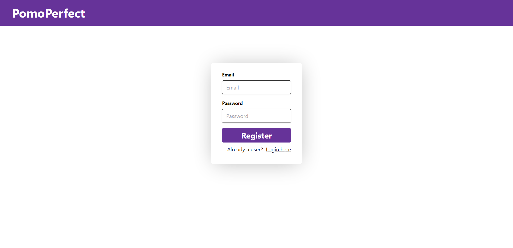
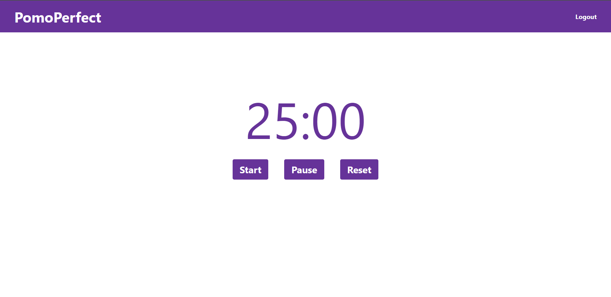

# PomoPerfect

## Description
Developed a web application that combines Firebase authentication, a Pomodoro timer, and modern UI styling using Tailwind CSS. 

## Features
Timer Functionality: Users can set a timer for focused work sessions (typically 25 minutes) followed by short break intervals (5 minutes).

Pause and Reset: Users have the ability to pause or reset the timer if needed. This flexibility accommodates interruptions or adjustments to work periods.

## Tech Stack
React: A popular JavaScript library for building user interfaces. 
JavaScript: For implementing app logic and interactivity. 
Tailwind CSS: Styled the application using Tailwind CSS to ensure an appealing and user-friendly design.

## Getting Started
Clone this repository to your local machine using git clone https://github.com/akashsonkamble/pomo-perfect.git Navigate to the project directory and install dependencies using npm install Start the development server using npm run dev Open your web browser and visit http://localhost:5173 to see the app in action.